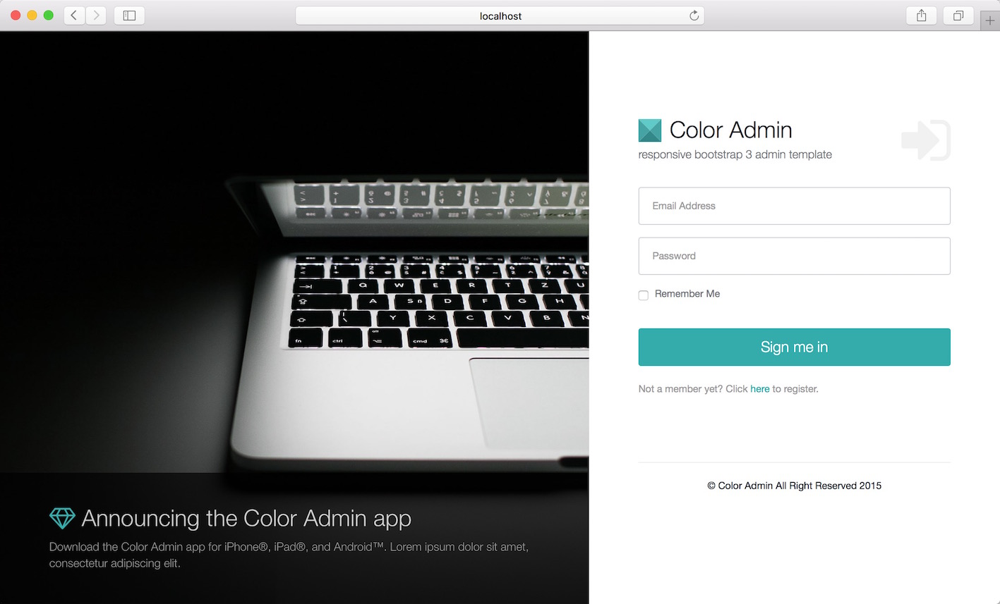
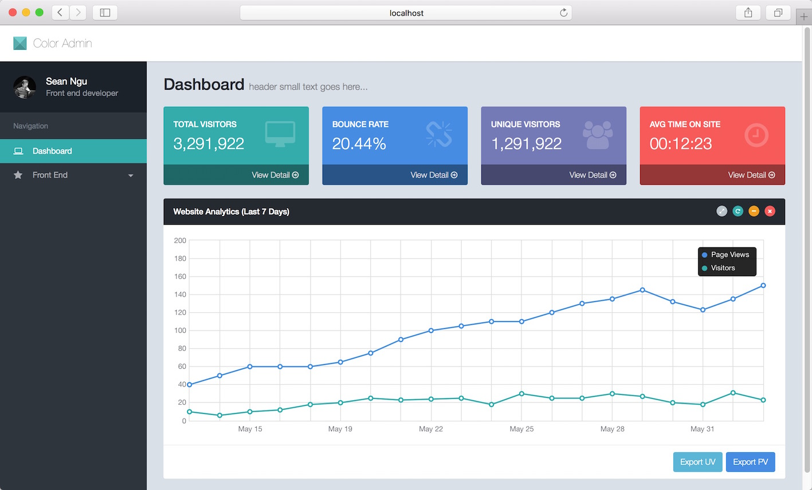

koa2-jwt-token-session
====

  [](https://hub.docker.com/r/superalsrk/koa2-boilerplate/builds/) [](https://microbadger.com/images/superalsrk/koa2-boilerplate "Get your own image badge on microbadger.com")

features including:

+ Use mysql in Koa2
+ CORS Ajax request
+ Ajax Login and Ajax Logout in Koa2, based on [koa-passport](https://github.com/rkusa/koa-passport) and [passport-local](https://github.com/jaredhanson/passport-local)
+ generate jwt token stored in Redis [jwt-redis-session](https://github.com/azuqua/jwt-redis-session)
+ Export excel in Koa2, based on [excel-export](https://github.com/functionscope/Node-Excel-Export)
+ Serve static files in Koa2
+ Integrate with Redux App
+ Use charts(D3.js, Echarts, plot) library in Redux App
+ Deploy Koa2 app with docker

### Preview

### Usage

**install mysql and redis**

prepare some user accounts in mysql

```

DROP TABLE IF EXISTS `users`;
/*!40101 SET @saved_cs_client     = @@character_set_client */;
/*!40101 SET character_set_client = utf8 */;
CREATE TABLE `users` (
  `userid` bigint(20) unsigned NOT NULL,
  `alias` varchar(100) NOT NULL DEFAULT '',
  `name` varchar(100) NOT NULL DEFAULT '',
  `surname` varchar(100) NOT NULL DEFAULT '',
  `passwd` char(32) NOT NULL DEFAULT '',
  `url` varchar(255) NOT NULL DEFAULT '',
  `autologin` int(11) NOT NULL DEFAULT '0',
  `autologout` int(11) NOT NULL DEFAULT '900',
  `lang` varchar(5) NOT NULL DEFAULT 'en_GB',
  `refresh` int(11) NOT NULL DEFAULT '30',
  `type` int(11) NOT NULL DEFAULT '1',
  `theme` varchar(128) NOT NULL DEFAULT 'default',
  `attempt_failed` int(11) NOT NULL DEFAULT '0',
  `attempt_ip` varchar(39) NOT NULL DEFAULT '',
  `attempt_clock` int(11) NOT NULL DEFAULT '0',
  `rows_per_page` int(11) NOT NULL DEFAULT '50',
  PRIMARY KEY (`userid`),
  KEY `users_1` (`alias`)
) ENGINE=InnoDB DEFAULT CHARSET=utf8;
/*!40101 SET character_set_client = @saved_cs_client */;

--
-- Dumping data for table `users`
--

LOCK TABLES `users` WRITE;
/*!40000 ALTER TABLE `users` DISABLE KEYS */;
INSERT INTO `users` VALUES (1,'nerds','test','werq','4e4ba04946basdfdfaedfa0d44507445','',1,0,'en_GB',30,3,'default',0,'10.50.13.69',1456854292,50),(2,'guest','','','d41d8cd98f00basdf9800998ecf8427e','',0,900,'en_GB',30,1,'default',0,'',0,50),(3,'demo','','','fe01ce2a7fbac8fafaed7c982a04e229','',1,0,'zh_CN',30,1,'default',0,'10.50.13.69',1460361004,50),(4,'wangmo','','','24d94c9e0ced6cb913daf7f67e8bbba6','',1,0,'en_GB',30,3,'default',0,'10.50.13.69',1462949818,50),(5,'duhaibo','','','4d3d82e202dfa673d3077f03b3be185d','',1,0,'en_GB',30,1,'default',0,'10.161.154.180',1461669672,50),(6,'shilei','','','4d3d82e202dfa673d3077f03b3be185d','',1,0,'en_GB',30,1,'default',0,'10.50.13.69',1460089101,50),(7,'demo1','','','fe01ce2a7fbac8fafaed7c982a04e229','',1,0,'en_GB',30,1,'default',0,'',0,50),(8,'lk.j','','','4d3d82e202dfa673d3077f03b3be185d','',1,0,'en_GB',30,1,'default',0,'10.161.154.21',1461040892,50);
/*!40000 ALTER TABLE `users` ENABLE KEYS */;
UNLOCK TABLES;
```

```bash
$ npm install 

# Start application
$ npm run dev

# Run test cases
$ npm run test

# Generate test report
$ npm run report
```

## Screenshots

+ Login Page



+ Dashboard



### License

MIT


 